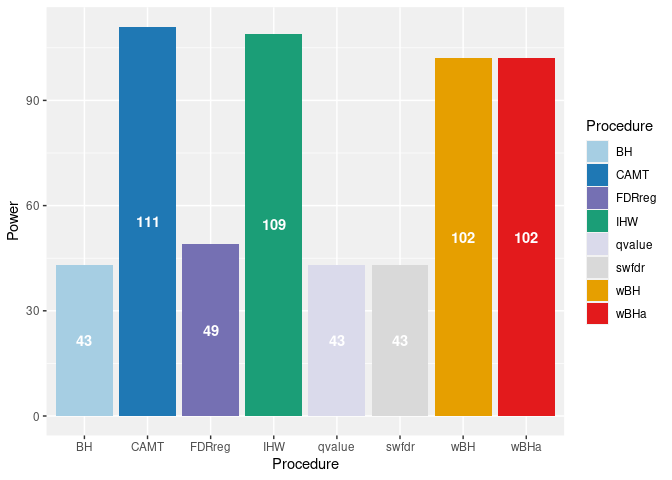
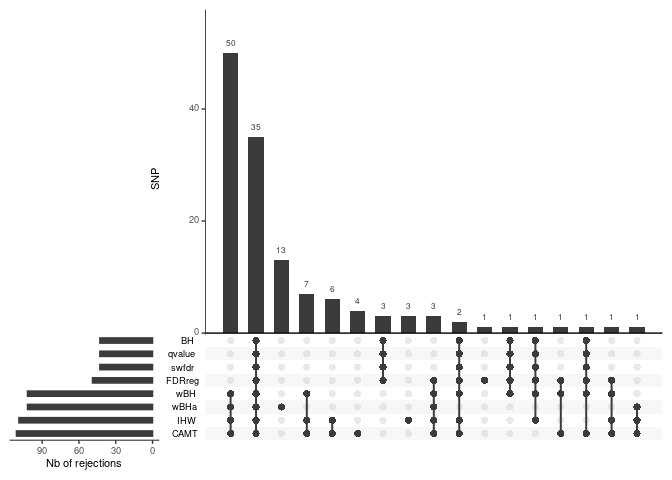
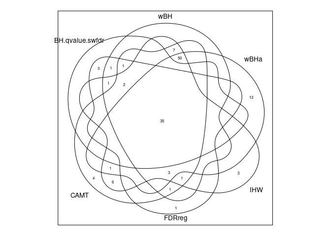

# GSE90102

## Application of procedures

``` r
data("GSE90102_01")

# Parameters
alpha <- 0.05
nfolds <- 60
pvalues <- GSE90102_01$rawp
covariates <- GSE90102_01$MAF


# wBHa procedure
res_wBHa <- wBHa(pvalues, covariates, alpha)
pval_wBHa <- res_wBHa$adjusted_pvalues
rej_wBHa <- which(pval_wBHa<=alpha)


# BH procedure 
pval_BH <- p.adjust(pvalues, method="BH")
rej_BH <- which(pval_BH<=alpha)

# IHW procedure
res_IHW <- ihw(pvalues~covariates, alpha=alpha)
pval_IHW <- adj_pvalues(res_IHW)
rej_IHW <- which(pval_IHW<alpha)

# wBH procedure
pval_wBH <- p.adjust(pvalues/((length(pvalues)/sum(1/covariates))*(1/covariates)), method="BH")
rej_wBH <- which(pval_wBH<=alpha)

# Qvalue procedure
res_qvalue <- qvalue(pvalues)
pval_qvalue <- res_qvalue$qvalues
rej_qvalue <- which(pval_qvalue<alpha)

# Swfdr procedure
res_qvalue <- lm_qvalue(pvalues, covariates)
pval_swfdr <- res_qvalue$qvalue
rej_swfdr <- which(pval_swfdr<alpha)

# FDRreg procedure
pvalues[pvalues==1]<-(1-10^-7)
zscores <- qnorm(pvalues)
res_FDRreg <- FDRreg(zscores, as.matrix(covariates))
pval_FDRreg <- res_FDRreg$FDR
rej_FDRreg <- which(pval_FDRreg<alpha)

# CAMT procedure
res_CAMT <- camt.fdr(pvals=pvalues,pi0.var=covariates)
pval_CAMT <- res_CAMT$fdr
rej_CAMT <- which(c(pval_CAMT<alpha))

rej_list <- list(BH=rej_BH, wBH=rej_wBH, wBHa=rej_wBHa, IHW=rej_IHW, qvalue=rej_qvalue, swfdr=rej_swfdr, 
                 FDRreg=rej_FDRreg, CAMT=rej_CAMT)
```

## Graphs

### Histogram of rejects

``` r
rej_tab <- data.frame(Procedure=c("BH", "wBH", "wBHa", "IHW", "qvalue", "swfdr", "FDRreg", "CAMT"), 
                      Power=unlist(lapply(rej_list, length)))

rej_histogram <- ggplot(data=rej_tab, aes(x=Procedure, y=Power, fill=Procedure)) + 
  geom_bar(stat="identity") + 
  scale_fill_manual(values=c("#A6CEE3","#1F78B4","#7570B3","#1B9E77","#DADAEB","#D9D9D9","#E69F00","#E31A1C")) + 
  geom_text(aes(label=round(Power,digits=1)), position=position_stack(0.5), color="white", fontface=c("bold")) + 
  theme(panel.background=element_rect(fill="#F0F0F0", colour="#F0F0F0", size=0.5, linetype="solid"), 
        panel.grid.major=element_line(size=0.5, linetype="solid", colour="white"), 
        panel.grid.minor=element_line(size=0.25, linetype="solid", colour="white"))
rej_histogram
```



### UpsetR graph

``` r
UpsetR_graph <- upset(fromList(rej_list), order.by="freq", mainbar.y.label="SNP", sets.x.label="Nb of rejections", 
                      nsets=8)
UpsetR_graph
```



### Venn diagram

``` r
# reduction of the number of groups: 8 to 6
rej_list$qvalue==rej_list$BH
```

    ##  [1] TRUE TRUE TRUE TRUE TRUE TRUE TRUE TRUE TRUE TRUE TRUE TRUE TRUE TRUE TRUE
    ## [16] TRUE TRUE TRUE TRUE TRUE TRUE TRUE TRUE TRUE TRUE TRUE TRUE TRUE TRUE TRUE
    ## [31] TRUE TRUE TRUE TRUE TRUE TRUE TRUE TRUE TRUE TRUE TRUE TRUE TRUE

``` r
rej_list$swfdr==rej_list$BH
```

    ##  [1] TRUE TRUE TRUE TRUE TRUE TRUE TRUE TRUE TRUE TRUE TRUE TRUE TRUE TRUE TRUE
    ## [16] TRUE TRUE TRUE TRUE TRUE TRUE TRUE TRUE TRUE TRUE TRUE TRUE TRUE TRUE TRUE
    ## [31] TRUE TRUE TRUE TRUE TRUE TRUE TRUE TRUE TRUE TRUE TRUE TRUE TRUE

``` r
rej_list2 <- list(BH.qvalue.swfdr=rej_BH, wBH=rej_wBH, wBHa=rej_wBHa, IHW=rej_IHW, FDRreg=rej_FDRreg, CAMT=rej_CAMT)
venn_diagram <- venn(rej_list2)
```



### Histogram of (causal) subgroups

``` r
calc_proportion_subgroup <- function(rej_vect){
  # Allows to compute the proportion of causal SNPs in each subgroup
  rares1 <- length(which((covariates[rej_vect]<0.05)==T))
  rares2 <- length(which((covariates[rej_vect]<0.10)==T))-(rares1)
  rares3 <- length(which((covariates[rej_vect]<0.15)==T))-(rares1+rares2)
  frequents <- length(which((covariates[rej_vect]>0.30)==T))
  medium <- length(rej_vect)-(rares1+rares2+rares3+frequents)
  nb<-c(rares1,rares2,rares3,medium,frequents)
  prop <- (nb/length(rej_vect))*100
  return(prop)
}

prop_subgroup_tab <- as.data.frame(cbind(c(rep("BH.qvalue.swfdr",5), rep("wBH",5), rep("wBHa",5), rep("IHW",5),
                                           rep("FDRreg",5), rep("CAMT",5)),c("5.Rare (MAF<0.05)", 
                                                                             "4.Rare (0.05<MAF<0.1)",
                                                                             "3.Rare (0.1<MAF<0.15)", 
                                                                             "2.Medium (0.15<MAF<0.3)", 
                                                                             "1.Frequent (0.3<MAF)"), 
                                         unlist(lapply(rej_list2,calc_proportion_subgroup))))
colnames(prop_subgroup_tab) <- c("Procedure", "Subgroups", "Proportion")
prop_subgroup_tab$Proportion <- as.numeric(prop_subgroup_tab$Proportion)

subgroup_hist <- ggplot(data=prop_subgroup_tab, aes(x=Procedure, y=Proportion, fill=Subgroups)) +
  geom_bar(stat="identity") + 
  scale_fill_brewer(palette="Blues") +
  labs(y="Proportion of rejected SNPs") +
  theme(panel.background=element_rect(fill="#F0F0F0", colour="#F0F0F0", size=0.5, linetype="solid"), 
        panel.grid.major=element_line(size=0.5, linetype="solid", colour="white"), 
        panel.grid.minor=element_line(size=0.25, linetype="solid", colour="white"))

subgroup_hist
```


## Relationship to annotations

SNPs found in the article present in our data and their respective
coordinates:

-   rs12494894 : 565881
-   rs72622838 : 325191
-   rs2238823 : 561177

``` r
search_rank <- function(pval_vect,alpha=0.05){
  # Allows to search the rank of the 3 SNPs present in our data for a given procedure
  pval_rank_tab <- data.frame(rank=c(1:length(pval_vect)), pvalues=pval_vect)
  pval_rank_tab_order <- pval_rank_tab[order(pval_rank_tab$pvalues),]
  pval_rank_tab_order <- cbind(pval_rank_tab_order, c(1:length(pval_vect)))
  pval_rank_tab_order_interest <- pval_rank_tab_order[c("565881", "325191", "561177"),] 
  pval_rank_tab_order_interest <- data.frame(SNP=c("rs12494894", "rs72622838", "rs2238823"), 
                                             Rank=pval_rank_tab_order_interest[,3], 
                                             Threshold=length(which((pval_vect<alpha))))
  return(pval_rank_tab_order_interest)
}

lapply(list(BH=pval_BH,CAMT=pval_CAMT,FDRreg=pval_FDRreg,IHW=pval_IHW,qvalue=pval_qvalue,swfdr=pval_swfdr,
            wBH=pval_wBH,wBHa=pval_wBHa), search_rank)
```

    ## $BH
    ##          SNP Rank Threshold
    ## 1 rs12494894   36        43
    ## 2 rs72622838   40        43
    ## 3  rs2238823   44        43
    ## 
    ## $CAMT
    ##          SNP Rank Threshold
    ## 1 rs12494894   73       111
    ## 2 rs72622838  712       111
    ## 3  rs2238823  103       111
    ## 
    ## $FDRreg
    ##          SNP Rank Threshold
    ## 1 rs12494894   36        49
    ## 2 rs72622838   41        49
    ## 3  rs2238823   43        49
    ## 
    ## $IHW
    ##          SNP Rank Threshold
    ## 1 rs12494894   92       109
    ## 2 rs72622838  426       109
    ## 3  rs2238823  147       109
    ## 
    ## $qvalue
    ##          SNP Rank Threshold
    ## 1 rs12494894   36        43
    ## 2 rs72622838   40        43
    ## 3  rs2238823   44        43
    ## 
    ## $swfdr
    ##          SNP Rank Threshold
    ## 1 rs12494894   36        43
    ## 2 rs72622838   40        43
    ## 3  rs2238823   44        43
    ## 
    ## $wBH
    ##          SNP Rank Threshold
    ## 1 rs12494894   66       102
    ## 2 rs72622838  117       102
    ## 3  rs2238823   96       102
    ## 
    ## $wBHa
    ##          SNP Rank Threshold
    ## 1 rs12494894  175       102
    ## 2 rs72622838  721       102
    ## 3  rs2238823  284       102
